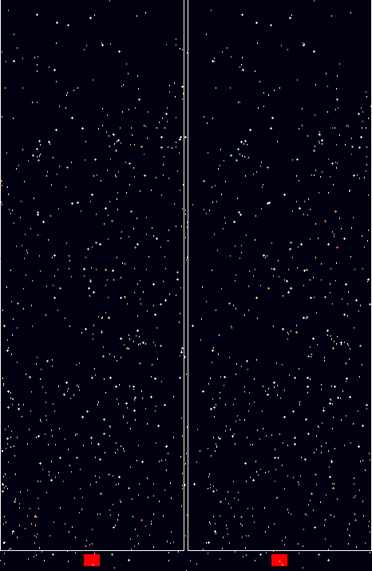
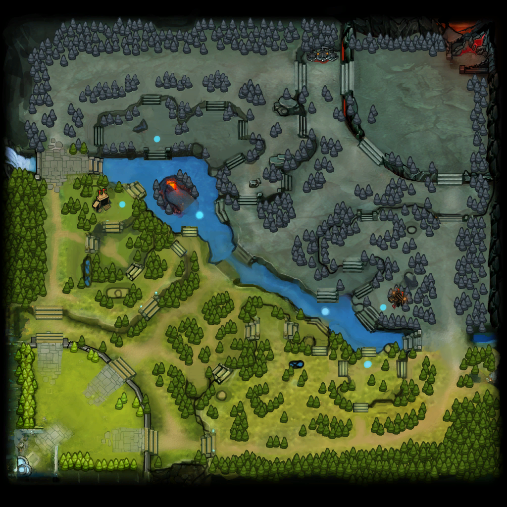

:last-update-label!:
:bibtex-file: bibliography.bib
:xrefstyle: short
:source-highlighter: coderay

= Visualising Space-Time Data
TODO: introduction to what the blog post is about

== The problem
Visually analysing time-dependent data is a common task in many fields. This, however, becomes problematic when the data is collected in a spatial context. The longstanding problem is: how does one visualise 2 or 3-dimensional data that evolves over time using computer screens and paper? In other words, how do you visualise 4-dimensional data on mediums that are inherently 2-dimensional?
There are different approaches one can take.

The first option is *reducing the dimensionality* of your data. For example, link:https://en.wikipedia.org/wiki/Principal_component_analysis[Principal Component Analysis] and link:https://en.wikipedia.org/wiki/Self-organizing_map[Self-Organising Maps] can sometimes be used to produce a "good-enough" 2-dimensional representation of 3-dimensional data. More simply, some problems do not require all of the original dimensions: for example, movement data on a flat terrain do not require an extra dimension to represent altitude.

A second option is to *use time as an extra dimension*. This is nothing new: for more than a century people have been using a fast-changing sequence of images to trick the eye into perceiving something as smoothly moving over time. This technique has been widely used to produce content such as animations, movies films, etc. Animations augment your medium of visualisation by a dimension, giving you more space to maneuver and represent your data.

A third option is to *use stereoscopic images* to transmit to the brain a third dimension using a 2-dimensional medium. The method relies on the ability of the brain to "understand" two images (of a 3-dimensional scene) taken at slightly different angles as a 3-dimensional scene. This, however, requires that each image is sent to one of the eyes; options to accomplish this include 1) link:https://en.wikipedia.org/wiki/Virtual_reality_headset[Virtual Reality headsets], 2) link:https://en.wikipedia.org/wiki/Polarized_3D_system[polarised glasses], 3) link:https://en.wikipedia.org/wiki/Anaglyph_3D[bi-colored goggles] and 4) simply crossing your eyes (see <<stereogram>>). The requirement for additional equipment and the awkwardness of crossing one's eyes make this option not widely viable.
[#stereogram]
.Hyades - the movement of stars in 300,000 years. To view this picture you need link:https://en.wikipedia.org/wiki/Stereoscopy#Side-by-side[cross-eyed viewing] (source: link:https://cs.wikipedia.org/wiki/Soubor:Astro_4D_hyades_cr_anim.gif[Wikipedia]).
[link=https://cs.wikipedia.org/wiki/Soubor:Astro_4D_hyades_cr_anim.gif]

One more option is to *simulate an extra dimension* on a 2-dimensional medium. This has been done for decades in movies and video-games: the scene is shown as flat, but the brain perceives it in 3 dimensions. This can be accomplished using link:https://en.wikipedia.org/wiki/Perspective_(graphical)[perspective] and link:https://en.wikipedia.org/wiki/Parallax[parallax movement], which transmit depth information to the brain.

In this blog post we focus on the latter option, and in particular on how to achieve an interactive 3-dimensional visualisation in Python using the link:https://plot.ly/[Plotly] library. Plotly provides the perspective representation out-of-the box, and its plots are interactive, which provides the movement much needed by the brain to interpret the plot effectively.
This type of visualisation is called a _space-time cube_, and was invented in the 70s by Torsten Hägerstraand cite:[hagerstraand1970people].

== Plotly limitation and workaround
When representing data whose context is spatial, plotting a terrain is most helpful to understand "where" the data points are located. Unfortunately, Plotly at the moment link:https://github.com/plotly/plotly.js/issues/1650[does not support] plotting a 2-dimensional image in a 3-dimensional plot (e.g. sticking it onto a plan embedded in the 3D scene).

However, it does support colouring a flat surface with a _colormap_ based on some value. We will bend this feature to our needs; that is, to visually represent an approximation of a terrain. The trick we will use involves two steps:

 . associating a scalar value to each pixel, and
 . associating values to colours, the same way link:https://commons.wikimedia.org/wiki/File:Heatmap_birthday_rank_USA.svg[heatmaps] do.

The trick is to create a custom colormap. Our colormap, instead of going from, say, green to black, will include a selection of colours representative enough that we can draw the map using those colours only.

As a use-case, we will take a video game, link:http://www.dota2.com/[_Defense of the Ancients 2_] (more commonly known as _DotA 2_). The game sees 2 teams of 5 players each, each team controlling half of the map, and having a base deep in their controlled area. The two teams fight each other with the objective to destroy the opponents base. <<dota2_map>> shows a sketch of the map.

[#dota2_map]
.The map used in DotA 2 (version 7.07, source: https://dota2.gamepedia.com/File:Minimap_7.07.png[Gamepedia]).
[link=https://dota2.gamepedia.com/File:Minimap_7.07.png]

To start with, we need to reduce the number of colours present in the image. We can achieve this in several ways. To keep this blog post limited, we will use an external tool, link:http://www.imagemagick.org/Usage/quantize/#colors[ImageMagick] to do the job. While we are at it, we will also crop and resize the image, because high resolutions are rendered slowly and high numbers of colours will look worse (more on this later).

.Resize and reduce the number of colours in the image
[#listing:resize-and-dither-image]
[source,bash]
----
convert Minimap_7.07.png \
  -crop 1000x940+10+30 \
  -resize 160000@ \
  +dither -colors 32 \
  Minimap_7.07_32colors.png
----

I am assuming you are running the code in a link:https://jupyter.org/[Jupyter Notebook]. The requirements for running the code in this blog post are:

.Requirements list
[source]
----
Cython==0.28.2
numpy==1.14.2
scipy==1.0.1
pandas==0.23.0
scikit-learn==0.19.1
matplotlib==2.2.2
plotly==2.5.1
scikit-image==0.14.0
imageio==2.3.0
Jupyter==1.0.0
colormath==3.0.0
ACO-pants==0.5.2
----

First of all, let's import all the modules and functions we will need.

.Import all the tools we need
[#listing:load-image]
[source,python]
----
import re
import numpy as np
import pandas as pd
import matplotlib.pyplot as plt
import plotly.graph_objs as go
from copy import deepcopy
from imageio import imread
from matplotlib.pyplot import imshow
from plotly.offline import init_notebook_mode, iplot, plot
init_notebook_mode(connected=True)

%matplotlib inline
----

We can now load and display the image using Python with the following code.

.Load and show map
[#listing:load-image]
[source,python]
----
# Load and display
img = imread('Minimap_7.07_resized_dithered.png')
imshow(img)
print(img.dtype, img.shape)
----

Python informs us that this image has a resolution of 387x412, with 4 values for the colours (RGB plus alpha).
The next step is to find the unique colours chosen by ImageMagick; that is, all the colours present in the image.
We can also display the colours found.

.Find the colour palette
[#listing:find-colors]
[source,python]
----
# Find colours
img_array = img[:, :, :3].reshape((img.shape[0] * img.shape[1], 3))
colors = np.unique(img_array, axis=0)
n_colors = colors.shape[0]
print(colors.shape)

# Show colours
def show_colors(colors):
    colors_matrix = np.reshape(colors, [4, n_colors // 4, 3])
    imshow(np.reshape(colors, (1, -1, 3)))
    plt.xticks([])
    plt.yticks([])
    plt.gcf().set_size_inches(10, 1)
show_colors(colors)
----

Python informs us that there are 32 colours, which is what we expect since that is how many colours we asked ImageMagick to use.
We then use the colours to create a custom Plotly colormap, which is nothing but a list of tuples with a float as first element and a string in the format `'rgb({}, {}, {})'` as second element, with integer values in the range 0-255. Plotly uses link:https://en.wikipedia.org/wiki/Linear_interpolation[linear interpolation] to determine the colours in between the points we provide.

.Create a custom Plotly colormap
[#listing:create-colormap]
[source,python]
----
# Create a custom colormap
color_to_value = {tuple(color[:3]): i / (n_colors - 1) for i, color in enumerate(colors)}
my_cmap_ply = [(value, 'rgb({}, {}, {})'.format(*color)) for color, value in color_to_value.items()]
----

Now that we have a colormap, we map each pixel to the value that corresponds to its colour within the colormap.

.Convert RGBs to appropriate values based on the colormap
[#listing:convert-pixels]
[source,python]
----
# Map pixels to values
fun_find_value = lambda x: color_to_value[tuple(x[:3])]
values = np.apply_along_axis(fun_find_value, 2, img)
----

We are now ready to show the terrain map in a 3-dimensional plot.

.Show the map on a 3D interactive plot
[#listing:show-terrain]
[source,python]
----
# Display terrain
yy = np.linspace(0, 1, img.shape[0])
xx = np.linspace(0, 1, img.shape[1])
zz = np.zeros(img.shape[:2])

surf = go.Surface(
    x=xx, y=yy, z=zz,
    colorscale=my_cmap_ply,
    surfacecolor=values,
    showscale=False
)
fig = go.Figure(data=go.Data([surf]), layout=go.Layout())
iplot(fig)
----

++++
<iframe src="dota2-terrain.html" height="850" width="950" frameborder="0"></iframe>
++++

== Add player movements
The terrain is nice and all, but it is not very useful in itself. The core point of space-time cubes is visualising data, so let's add data!

The good Prof. Anders Drachen from the link:http://www.digitalcreativity.ac.uk/[DC Labs] at University of York happens to have a dataset of DotA2 games, including movement data. The dataset is not publicly available, but he us allowed to showcase a match for this blog post.

The data of each match was provided in a CSV file with a series of columns containing heroes data over time, plus a column indicating the time, labelled `tick`. We will use this data for the rest of the post. The columns we will use are spatial coordinates, cumulative death counters and a flag indicating whether the hero was alive at the time (as opposed to being dead and waiting to respawn). Column names follow a specific pattern, which can be matched against to extract information about the players. The data in all columns (except time) is sparse, meaning that values are only present when a value changes. Let's load the data, forward-fill the data, and visualise a random row:

.Load, forward-fill and display data
[source,python]
----
# Load and display data
df = pd.read_csv('2842231742.csv')
cols = [col for col in df.columns if
        col.startswith('X_') or
        col.startswith('Y_') or
        col.startswith('Deaths_') or
        col.startswith('IsAlive_')
       ] + ['tick']
df = df[cols]
df.ffill(inplace=True)
print(df.iloc[1000,:])
----
The snippet above outputs:
----
Deaths_0_R_enigma_L                  0.00000
IsAlive_0_R_enigma_L                 1.00000
X_0_R_enigma_L                   -5029.00000
Y_0_R_enigma_L                    1187.00000
...
Deaths_9_D_juggernaut_W              2.00000
IsAlive_9_D_juggernaut_W             1.00000
X_9_D_juggernaut_W               -5471.00000
Y_9_D_juggernaut_W                5630.00000
tick                               176.70154
Name: 1000, dtype: float64
----

Now let's extract players information from the columns and have a look at it:

.Extract players information
[source,python]
----
# Infer players data from column names
players = set()
pattern = re.compile(r'[^_]+_([0-9])_(R|D)_([a-z_]+)_(W|L)')
for col in df.columns:
    match = re.match(pattern, col)
    if match:
        player_id, team, hero, outcome = match.groups()
        players.add((player_id, team, hero, outcome))
print("\n".join([str(t) for t in sorted(players)]))
----
which outputs
----
('0', 'R', 'enigma', 'L')
('1', 'R', 'life_stealer', 'L')
('2', 'R', 'axe', 'L')
('3', 'R', 'witch_doctor', 'L')
('4', 'R', 'earth_spirit', 'L')
('5', 'D', 'ursa', 'W')
('6', 'D', 'disruptor', 'W')
('7', 'D', 'bounty_hunter', 'W')
('8', 'D', 'legion_commander', 'W')
('9', 'D', 'juggernaut', 'W')
----

Now we have player IDs, their team, hero names and whether the team won or lost. Instead of generating movement traces straight-away, we will first create a dictionary containing the style for each hero in Plotly format. We will refer to these styles later, when plotting the legend.

.Setting the styles
[source,python]
----
# Set styles
styles = {}
for player_id, team, hero, outcome in players:
    color = '#0088FF' if team == 'D' else '#FF530D'
    styles[hero] = {
        'mode': 'lines',
        'line': go.Line(color=color),
        'legendgroup': hero.replace('_', ' ').title(),
        'name': '{hero} ({team})'.format(hero=hero.replace('_', ' ').title(), team=team)
    }
----

The next step is to generate Plotly traces by iterating through players.
Instead of drawing a continuous line start-to-end, we will split the data of each hero using the deaths counter column. We do this because in DotA2, when heroes die, they re-appear in their base: deaths would be shown as long, straight lines, which could be confusing.

.Generating movement traces
[source,python]
----
# Generate movement traces
traces = []
col_suffix_pattern = '_{player_id}_{team}_{hero}_{outcome}'
for player_id, team, hero, outcome in players:
    col_suffix = col_suffix_pattern.format(player_id=player_id, team=team, hero=hero, outcome=outcome)
    for _, sub_df in df.groupby('Deaths' + col_suffix):
        sub_df = sub_df[sub_df['IsAlive' + col_suffix] == 1]
        xx = sub_df['X' + col_suffix].values
        yy = sub_df['Y' + col_suffix].values
        zz = sub_df['tick'].values
        style = styles[hero]
        trace = go.Scatter3d(
            x=xx, y=yy, z=zz,
            showlegend=False,
            **style
        )
        traces.append(trace)
----

Instead, we will draw death "teleportations" as dashed lines.

.Generating death teleportation traces
[source,python]
----
# Generate death traces
for player_id, team, hero, outcome in players:
    col_suffix = col_suffix_pattern.format(player_id=player_id, team=team, hero=hero, outcome=outcome)

    spawn_locs, death_locs = [], [(np.nan, np.nan, np.nan)]
    for _, sub_df in df.groupby('Deaths' + col_suffix):
        sub_df = sub_df[sub_df['IsAlive' + col_suffix] == 1]
        xx = sub_df['X' + col_suffix].values
        yy = sub_df['Y' + col_suffix].values
        zz = sub_df['tick'].values
        # Save spawn and death location for this "life"
        spawn_locs.append((xx[0], yy[0], zz[0]))
        death_locs.append((xx[-1], yy[-1], zz[-1]))
    spawn_locs.append((np.nan, np.nan, np.nan))

    # Pairwise iterate death and spawn locations (misaligned on purpose with those NaNs)
    for death_loc, spawn_loc in zip(death_locs, spawn_locs):
        style = deepcopy(styles[hero])
        style['line'] = go.Line(color=style['line']['color'], dash='dash')
        xx = [death_loc[0], spawn_loc[0]]
        yy = [death_loc[1], spawn_loc[1]]
        zz = [death_loc[2], spawn_loc[2]]
        trace = go.Scatter3d(
            x=xx, y=yy, z=zz,
            showlegend=False,
            **style
        )
        traces.append(trace)
----

The last step is to add a legend, hero-by-hero, which can be used to turn off single lines (hence having a style for each hero instead of one per team).

.Setting up the legend
[source,python]
----
# Setup legend
for legend_group, style in styles.items():
    trace = go.Scatter3d(
        x=[np.nan], y=[np.nan], z=[np.nan],
        **style
    )
    traces.append(trace)
----

The final step is to generate and save the final result.

.Visualising the result
[source,python]
----
yy = np.linspace(-8000, +8000, img.shape[0])
xx = np.linspace(-8000, +8000, img.shape[1])
zz = np.full(img.shape[:2], -90)

surf = go.Surface(
    x=xx, y=yy, z=zz,
    colorscale=my_cmap_ply,
    surfacecolor=values,
    showscale=False
)

layout = go.Layout(
    width=800,
    height=800,
    margin=dict(l=0,r=0,b=0,t=0),
    scene=go.Scene(
        xaxis=go.XAxis(title='', showticklabels=False),
        yaxis=go.YAxis(title='', showticklabels=False),
        zaxis=go.ZAxis(title='Time (s)'),
        aspectratio=dict(x=1, y=1, z=1.8)
    )
)
fig = go.Figure(data=go.Data([surf] + traces), layout=layout)
iplot(fig, filename='dota2-terrain-and-paths')
plot(fig, filename='dota2-space-time-cube.html', auto_open=False)
----

++++
<iframe src="dota2-space-time-cube.html" height="850" width="950" frameborder="0"></iframe>
++++

=== Bonus - improving the map looks
If you zoom in on the terrain, you can notice artifacts between colours. This is an unwanted consequence of bringing down a 3-dimensional space (the space of RGB colours) to a 1-dimensional space (the colormap). When we did that, we artificially put an order to the colours, and now when Plotly wants to smoothly transition from colour A to colour B, it will use all the colours in between A and B.
Since the colours are arranged in whatever order numpy found them in, it can happen that black is in between two shades of green: this will cause there being a black line between any two adjacent pixels with those shades of green. There is no way around this, but there is a way to mitigate this effect: sorting the colours such that they are in a "visually smooth" order, whatever that means.

The way I approached this problem is to find the "shortest visual path" through all the colours. This is an instance of the famous link:https://en.wikipedia.org/wiki/Travelling_salesman_problem[Traveling Salesman Problem], and as such is NP-hard. As far as science knows, there is no way to  solve this problem efficiently; that is, there is no way to find _the best_ solution.
However, there are a number of algorithms to compute approximate solutions. The first coming to my mind are link:https://en.wikipedia.org/wiki/Metaheuristic[meta-heuristics], strategies to solve optimisation problems that "tend to work"; the most famous examples are evolutionary computation algorithms. Conveniently, there is a Python package that approximately solves the TSP problem using link:https://en.wikipedia.org/wiki/Ant_colony_optimization_algorithms[ant-colony optimisation], link:https://pypi.org/project/ACO-Pants/[ACO-pants].

We can use the library to solve our colours sorting problem if we can provide a function computing our notion of "visual distance" between two colours. It turns out this is a common enough problem that standards have been created and that a Python implementation exists. Enter link:https://en.wikipedia.org/wiki/Color_difference#CIEDE2000[Delta E CIE 2000] and the link:https://python-colormath.readthedocs.io/en/latest/delta_e.html#colormath.color_diff.delta_e_cie2000[colormath] package.

We are all set to solve the problem.

.Sort colours "visually"
[#listing:sort-colors]
[source,python]
----
# Sort colours
from colormath.color_diff import delta_e_cie2000
from colormath.color_objects import LabColor, sRGBColor
from colormath.color_conversions import convert_color
from pants import World, Solver
def rgb_distance(color1, color2):
    color1 = sRGBColor(*color1)
    color2 = sRGBColor(*color2)
    color1 = convert_color(color1, LabColor)
    color2 = convert_color(color2, LabColor)
    return float(delta_e_cie2000(color1, color2))
colors = [tuple(c) for c in colors]
solution = Solver().solve(World(colors, rgb_distance))
colors = np.array(solution.tour)
print(colors.shape)
show_colors(colors)
----

++++
<iframe src="dota2-terrain-improved.html" height="850" width="950" frameborder="0"></iframe>
++++

== Bibliography
bibliography::[]